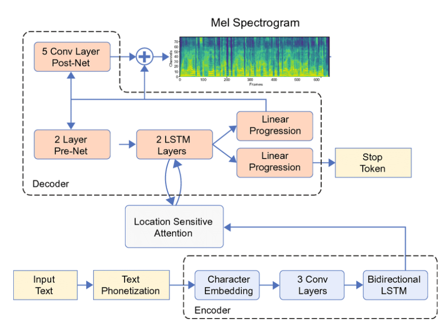

# (TTS) Tacotron2 Model: Mel - Spectrogram Generation
## Model Architecture


## Folder Structure
    assets                      # Assets Folder of README
    config.json                 # Configuration Training
    guide.ipynb                # Guide of Model and Processor
    phonemes.json               # Phonemes Dictionary
    .gitignore
    processor.py                # Data Handler
    README.md
    requirements.txt
    tacotron2.py                # Tacotron2 Model
    train.py                    # Training File
    trainer.py                  # Trainer for Model

## Setup Dataset
| Name    | Link |
| --------- | ------- |
| InfoRE Tech 16h     | https://huggingface.co/datasets/ntt123/infore/resolve/main/infore_16k_denoised.zip        |

## Setup Environment
```
git clone https://git.cads.live/trind18/mel-generation-tacotron2.git
cd mel-generation-tacotron2
python3 -m venv tts
source tts/bin/activate
pip install -r requirements.txt
```

## Train Model
```
python3 train.py --config_path ./config/config.json
```